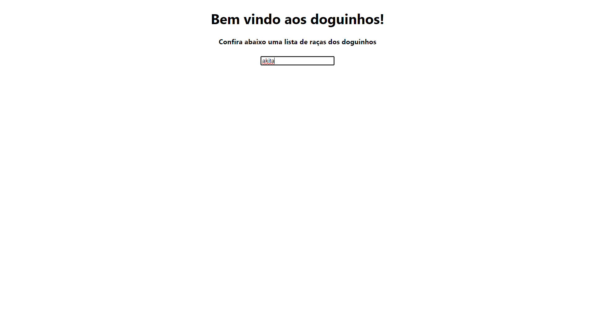

# Consumindo API com useEffect

## Sumário

1. [Objetivo](#objetivo)
2. [Como utilizar](#como-utilizar)
3. [Exemplo de utilização](#exemplo-de-utilização)

## Objetivo

O objetivo deste projeto é ser apenas um pequeno estudo sobre useEffect, funcionalidade presente no React.

Neste projeto é abordado o consumo de uma API de raças de cães e apresentado, de maneira bem simples, na interface, podendo ser feita a busca pelo nome da raça.

Para o desenvolvimento foi utilizado o json-server.

## Como utilizar

Caso queira utilizar da mesma maneira do desenvolvimento, é necessário que possua o [Node](https://nodejs.org/pt) instalado (versão de desenvolvimento: 20.11.0) e o [json-server](https://www.alura.com.br/artigos/mockando-apis-rest-com-json-server) (versão de desenvolvimento: 1.0.0-beta.2).

Dessa forma, com essas dependências instaladas, é necessário clonar este repositório e, ao finalizar, rodar os seguintes comandos na raiz do projeto:

1. Instalar as dependências do projeto:

```cmd
npm install
```

2. Iniciar o projeto

```cmd
npm start
```

O projeto será iniciado em http://localhost:3000, basta acessá-lo via navegador e utilizá-lo.

## Exemplo de utilização

Assim que carregar a página as raças já serão carregadas.


Caso queira buscar por uma raça em específico, basta colocar o nome dela no campo "Buscar por raça".


A partir de 3 dígitos o sistema irá realizar a busca da raça, caso seja menos, irá retornar todas as raças.

É necessário, caso esteja utilizando json-server na versão citada, passar o nome da raça direitinho pois ele diferencia se as letras são maiúsculas e minúsculas e também a busca é realizada exatamente como está escrito. Na imagem anterior é demonstrado a busca por "Akita", caso estivesse como "akita" ele não traria nenhum resultado, assim como apresentado na imagem a seguir.

